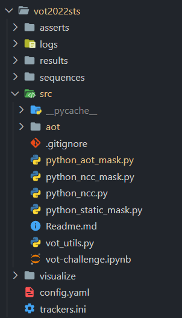

## Install vot package and download dataset

```
pip install git+https://github.com/votchallenge/vot-toolkit-python
vot initialize vot2022/sts --workspace ./
```

## Other requirements
```
git clone https://github.com/yoxu515/aot-benchmark.git ./aot
```


## Add tracker
```
[aot]  # <tracker-name>
label = aot
protocol = traxpython
command = python_aot_mask
paths = /data2/sun/vot2022sts/src/
env_PATH = /home/sunchao/anaconda3/envs/vot/bin/python;${PATH}
```


Add aot path in python_aot_mask.py
```
sys.path.append(AOT_PATH) 
```


## File sructure


